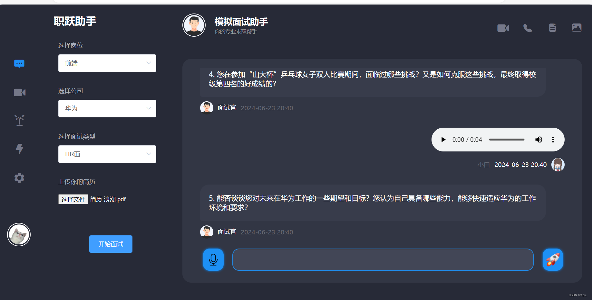
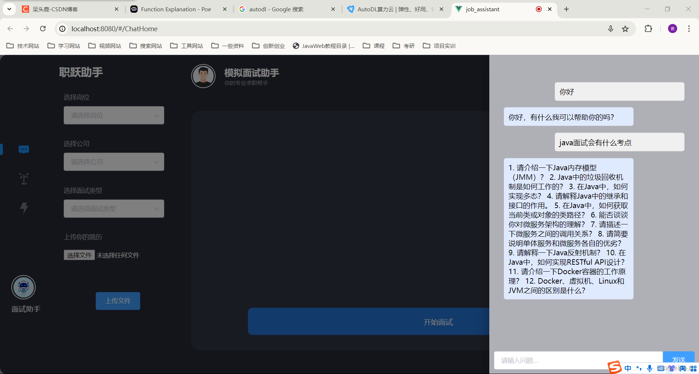
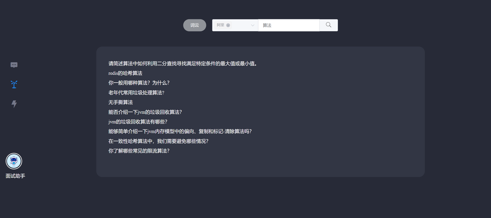
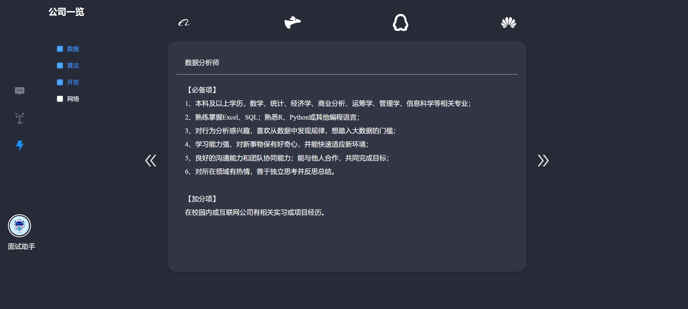
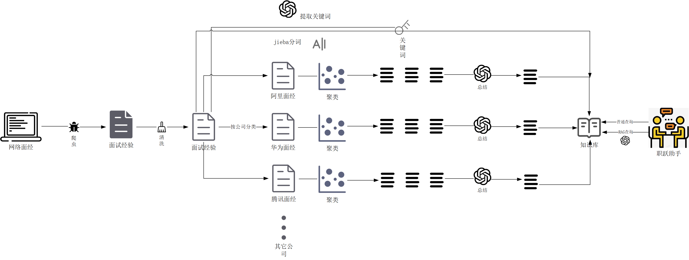
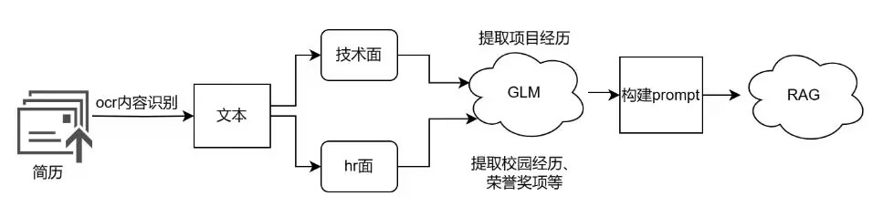

# Career Asistant

This is an AI-based platform to help you find a job for the first time

# Functions

## Mock Interview

You can choose a desired position, company and interview type. After uploading your CV, you can interview with an AI. The AI interviewer will ask you question regarding your CV, work position and what you know about the company.

## Bot

A folded AI bot to help you answer any questions regarding to finding a job. You can ask them about company information, interview skills ect.

## Interview Questions

You can select a company and find out most frequenctly been asked questions during an interview.

## Job Information

You can select a company and your desired positions to see the requirements.

# Methods

## Knowledge Base

## Mock Interview

